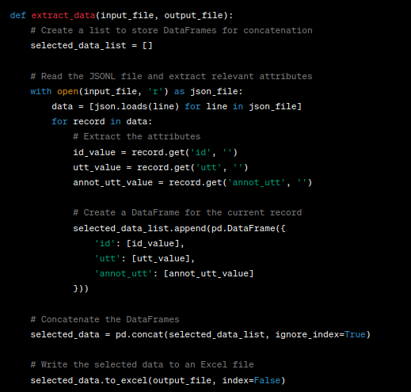
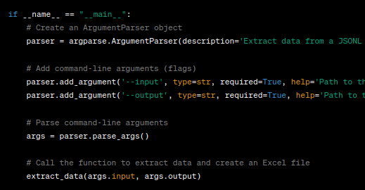
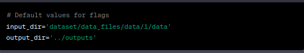
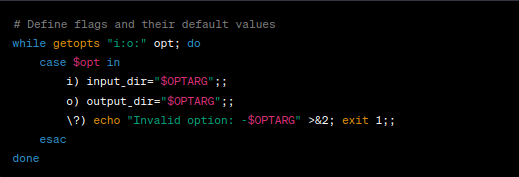
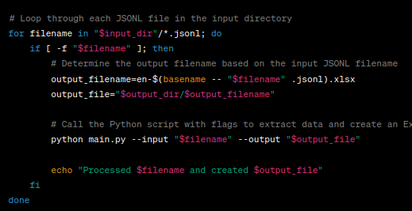
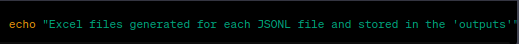

## main.py
## Extract Data from JSONL to Excel

This Python script extracts data from a JSONL file and creates an Excel file with selected attributes. It uses the argparse library for command-line argument handling and the pandas library for working with data in DataFrames.
## Script Overview
The script performs the following tasks:
1. Reads a JSONL (JSON Lines) file.
2. Extracts relevant attributes from each JSON record.
3. Creates a DataFrame for each record.
4. Concatenates these DataFrames.
5. Writes the selected data to an Excel file.

## Code Explanation
### Imports

- The script imports necessary libraries
- **argparse** for command-line argument parsing
- **json** for working with JSON data
- **os** for file operations
- **pandas** for data manipulation.
### Data Extraction

- The extract_data function takes two parameters: input_file (path to the input JSONL file) and output_file (path to the output Excel file).

Inside the function:
- It initializes an empty list selected_data_list to store DataFrames.
- Reads the JSONL file line by line, parsing each line as a JSON record.
- Extracts three attributes from each record: 'id,' 'utt' (utterance), and 'annot_utt' (annotated utterance).
- Creates a DataFrame for each record with these extracted attributes and appends it to selected_data_list.
- After processing all records, it concatenates the DataFrames in selected_data_list into a single DataFrame called selected_data using pd.concat.
- Finally, it writes the selected_data DataFrame to an Excel file specified by output_file.
### Main Code

- The script defines the main block to be executed when the script is run.
- It uses the argparse library to create an ArgumentParser object that handles command-line arguments.
- Two command-line arguments are added:
        --input: Specifies the path to the input JSONL file (required).
        --output: Specifies the path to the output Excel file (required).
- The script parses the command-line arguments using parser.parse_args() and stores them in the args object.
- Finally, it calls the extract_data function with the provided input and output file paths to perform the data extraction and Excel file creation.

## generator.sh
## Bash Script for Extracting Data from JSONL to Excel
- This Bash script is designed to automate the process of extracting data from JSONL (JSON Lines) files and creating corresponding Excel files. It utilizes command-line arguments (flags) to specify input and output directories. The script loops through all JSONL files in the input directory, processes each file, and generates Excel files in the specified output directory.
## Script Overview

The script performs the following tasks:

1. Sets default values for input and output directories.
2. Defines command-line flags and their default values.
3. Loops through each JSONL file in the input directory.
4. Determines the output filename based on the input JSONL filename.
5. Calls a Python script (main.py) to extract data and create an Excel file.
6. Displays processing messages.

## Code Explanation
### Default Values

- The script sets default values for the input and output directories. These values will be used if the user does not specify custom directories using flags.
### Define Flags

- This section defines the command-line flags and their default values using the getopts construct. The flags include:

- -i: Specifies the input directory (default is 'dataset/data_files/data/1/data').
- -o: Specifies the output directory (default is '../outputs').

- Users can provide these flags when running the script to specify custom input and output directories.
### Loop Through JSONL Files

- This section of the script performs the core processing:

- It uses a for loop to iterate through each JSONL file in the input directory.
- The if condition checks if the file exists (-f) before proceeding.
- It determines the output filename for the corresponding Excel file based on the input JSONL filename.
- It calls a Python script (main.py) and provides the input and output file paths as flags.
- After processing each file, it displays a message indicating the processing status.
### Final Message

- At the end of the script, it prints a message indicating that Excel files have been generated for each JSONL file and stored in the 'outputs' directory.
### Usage

- To use this Bash script, follow these steps:

1. Save the script to a file, e.g., generate_excel.sh.
2. Open a terminal/command prompt.
3. Navigate to the directory containing the script.
4. Run the script with the following command:

        ./generator.sh
