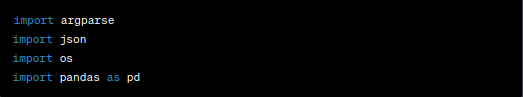

# Extract Data from JSONL to Excel

## main.py

This Python script extracts data from a JSONL file and creates an Excel file with selected attributes. It uses the argparse library for command-line argument handling and the pandas library for working with data in DataFrames.
## Script Overview
The script performs the following tasks:
1. Reads a JSONL (JSON Lines) file.
2. Extracts relevant attributes from each JSON record.
3. Creates a DataFrame for each record.
4. Concatenates these DataFrames.
5. Writes the selected data to an Excel file.

## Code Explanation
### Imports

- The script imports necessary libraries
- **argparse** for command-line argument parsing
- **json** for working with JSON data
- **os** for file operations
- **pandas** for data manipulation.
### Data Extraction

- The extract_data function takes two parameters: input_file (path to the input JSONL file) and output_file (path to the output Excel file).

Inside the function:
- It initializes an empty list selected_data_list to store DataFrames.
- Reads the JSONL file line by line, parsing each line as a JSON record.
- Extracts three attributes from each record: 'id,' 'utt' (utterance), and 'annot_utt' (annotated utterance).
- Creates a DataFrame for each record with these extracted attributes and appends it to selected_data_list.
- After processing all records, it concatenates the DataFrames in selected_data_list into a single DataFrame called selected_data using pd.concat.
- Finally, it writes the selected_data DataFrame to an Excel file specified by output_file.
### Main Code

- The script defines the main block to be executed when the script is run.
- It uses the argparse library to create an ArgumentParser object that handles command-line arguments.
- Two command-line arguments are added:
        --input: Specifies the path to the input JSONL file (required).
        --output: Specifies the path to the output Excel file (required).
- The script parses the command-line arguments using parser.parse_args() and stores them in the args object.
- Finally, it calls the extract_data function with the provided input and output file paths to perform the data extraction and Excel file creation.

```python
import argparse
import json
import os
import pandas as pd

def extract_data(input_file, output_file):
    # Create a list to store DataFrames for concatenation
    selected_data_list = []

    # Read the JSONL file and extract relevant attributes
    with open(input_file, 'r') as json_file:
        data = [json.loads(line) for line in json_file]
        for record in data:
            # Extract the attributes
            id_value = record.get('id', '')
            utt_value = record.get('utt', '')
            annot_utt_value = record.get('annot_utt', '')

            # Create a DataFrame for the current record
            selected_data_list.append(pd.DataFrame({
                'id': [id_value],
                'utt': [utt_value],
                'annot_utt': [annot_utt_value]
            }))

    # Concatenate the DataFrames
    selected_data = pd.concat(selected_data_list, ignore_index=True)

    # Write the selected data to an Excel file
    selected_data.to_excel(output_file, index=False)

if __name__ == "__main__":
    # Create an ArgumentParser object
    parser = argparse.ArgumentParser(description='Extract data from a JSONL file and create an Excel file.')

    # Add command-line arguments (flags)
    parser.add_argument('--input', type=str, required=True, help='Path to the input JSONL file')
    parser.add_argument('--output', type=str, required=True, help='Path to the output Excel file')

    # Parse command-line arguments
    args = parser.parse_args()

    # Call the function to extract data and create an Excel file
    extract_data(args.input, args.output)

```

## generator.sh
## Bash Script for Extracting Data from JSONL to Excel
- This Bash script is designed to automate the process of extracting data from JSONL (JSON Lines) files and creating corresponding Excel files. It utilizes command-line arguments (flags) to specify input and output directories. The script loops through all JSONL files in the input directory, processes each file, and generates Excel files in the specified output directory.
## Script Overview

The script performs the following tasks:

1. Sets default values for input and output directories.
2. Defines command-line flags and their default values.
3. Loops through each JSONL file in the input directory.
4. Determines the output filename based on the input JSONL filename.
5. Calls a Python script (main.py) to extract data and create an Excel file.
6. Displays processing messages.

## Code Explanation
### Default Values

- The script sets default values for the input and output directories. These values will be used if the user does not specify custom directories using flags.
### Define Flags

- This section defines the command-line flags and their default values using the getopts construct. The flags include:

- -i: Specifies the input directory (default is 'dataset/data_files/data/1/data').
- -o: Specifies the output directory (default is '../outputs').

- Users can provide these flags when running the script to specify custom input and output directories.
### Loop Through JSONL Files

- This section of the script performs the core processing:

- It uses a for loop to iterate through each JSONL file in the input directory.
- The if condition checks if the file exists (-f) before proceeding.
- It determines the output filename for the corresponding Excel file based on the input JSONL filename.
- It calls a Python script (main.py) and provides the input and output file paths as flags.
- After processing each file, it displays a message indicating the processing status.
### Final Message

- At the end of the script, it prints a message indicating that Excel files have been generated for each JSONL file and stored in the 'outputs' directory.
### Usage

- To use this Bash script, follow these steps:

1. Save the script to a file, e.g., generate_excel.sh.
2. Open a terminal/command prompt.
3. Navigate to the directory containing the script.
4. Run the script with the following command:
```bash
./generator.sh
```
```bash
#!/bin/bash

# Default values for flags
input_dir='dataset/data_files/data/1/data'
output_dir='../outputs'

# Define flags and their default values
while getopts "i:o:" opt; do
    case $opt in
        i) input_dir="$OPTARG";;
        o) output_dir="$OPTARG";;
        \?) echo "Invalid option: -$OPTARG" >&2; exit 1;;
    esac
done

# Loop through each JSONL file in the input directory
for filename in "$input_dir"/*.jsonl; do
    if [ -f "$filename" ]; then
        # Determine the output filename based on the input JSONL filename
        output_filename=en-$(basename -- "$filename" .jsonl).xlsx
        output_file="$output_dir/$output_filename"

        # Call the Python script with flags to extract data and create an Excel file
        python main.py --input "$filename" --output "$output_file"

        echo "Processed $filename and created $output_file"
    fi
done

echo "Excel files generated for each JSONL file and stored in the 'outputs'"

```

## sperate.py
```python
import json
import os
import pandas as pd

# Define the directory containing JSONL files
jsonl_dir = 'dataset/data_files/data/1/data'

# Create the "outputs" folder if it doesn't exist
output_folder = 'outputs'
os.makedirs(output_folder, exist_ok=True)

# Load data from multiple JSONL files into a single DataFrame
all_data = pd.DataFrame()
for filename in os.listdir(jsonl_dir):
    if filename.endswith('.jsonl'):
        file_path = os.path.join(jsonl_dir, filename)
        data = pd.read_json(file_path, lines=True)
        all_data = pd.concat([all_data, data], ignore_index=True)

# Define the languages of interest (English, Swahili, German)
languages = ['en', 'sw', 'de']

# Create separate JSONL files for each language and set (test, train, dev)
for language in languages:
    for set_name in ['test', 'train', 'dev']:
        # Filter data for the current language and set
        filtered_data = all_data[(all_data['locale'].str.split('-').str[0] == language) & (all_data['partition'] == set_name)]
        
        # Determine the output filename
        output_filename = f'{language}_{set_name}.jsonl'
        output_file = os.path.join(output_folder, output_filename)

        # Save the filtered data to a JSONL file
        filtered_data.to_json(output_file, orient='records', lines=True)

print("JSONL files generated and stored in the 'outputs' folder.")

```
## translate.py
```python
import pandas as pd
import json
import os

# Define the paths to the JSONL files
en_train_file = 'outputs2/en_train.jsonl'
sw_train_file = 'outputs2/sw_train.jsonl'
de_train_file = 'outputs2/de_train.jsonl'

# Read the JSONL files into DataFrames, selecting only 'id' and 'utt' columns
en_train_df = pd.read_json(en_train_file, lines=True)[['id', 'utt']]
sw_train_df = pd.read_json(sw_train_file, lines=True)[['id', 'utt']]
de_train_df = pd.read_json(de_train_file, lines=True)[['id', 'utt']]

# Merge DataFrames based on 'id'
merged_df = en_train_df.merge(sw_train_df, on='id', suffixes=('_en', '_sw'))
merged_df = merged_df.merge(de_train_df, on='id', suffixes=('_en', '_de'))

# Rename columns to match the desired format
merged_df = merged_df.rename(columns={'utt_en': 'en', 'utt_sw': 'sw', 'utt': 'de'})

# Save the merged DataFrame to a JSONL file with pretty printing
output_file = 'merged_data.jsonl'
with open(output_file, 'w', encoding='utf-8') as jsonl_output_file:
    jsonl_output_file.write(merged_df.to_json(orient='records', lines=True, indent=2))

print("Data merged and saved to 'merged_data.jsonl' with pretty printing")

```
